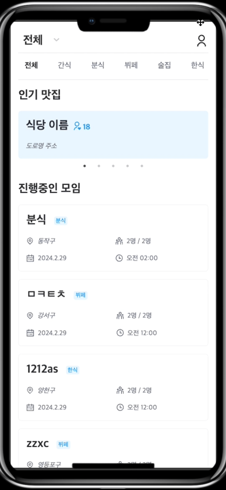

## Overview

> 🍚 먹고싶은 음식이 있는데 혼자 먹기엔 부담스럽다? **LetEatGo**에서 `맛집 메이트`를 찾아보세요!

- 1인 가구는 2000년부터 꾸준히 증가하는 추세입니다.
    - 2022년에는 `34.5%`로, 우리나라 주 가구 구성이었던 4인 가구의 비율(13.8%)을 뛰어 넘었습니다.
- 그렇지만 1인 가구가 늘었음에도 혼밥을 위해서는 식당도, 메뉴도 한정적일 때가 많습니다.
    - **2인 이상의 식당**, **2인 이상 주문 가능한 메뉴들**.. 여행이나 출장으로 다른 지역을 갔을 때, 그 지역의 맛집을 두고 편의점이나 패스트푸드점을 이용해본
      경험이 있지 않으신가요?
- 그래서 혼자 밥먹는 사람들도 먹고 싶은 음식을 다양하게 맛볼 수 있는 `맛집 모임 서비스`를 만들고자 합니다.

👀 가고싶은 맛집을 선정하여 모임을 개설할 수 있습니다.

💬 모임에 참여하여 채팅을 통해 세부 일정을 잡거나 궁금한 점을 물어볼 수 있습니다.

🔔 모임원은 모임의 상태에 따라 알림을 받을 수 있습니다. (취소, 완료, 리마인드)

👍 모임이 끝나면 모임원들을 평가할 수 있습니다. 모임원들에게 좋은 평가를 받으면 매너온도가 올라갑니다.

## 시연 영상

## Project

### 프로젝트 아키텍처

### CI/CD

### 기술 스택

### ERD

### 주요 기능

| 회원가입                                     | 로그인                                     | 구글 로그인                                    |
|------------------------------------------|-----------------------------------------|-------------------------------------------|
|  |  |  |

| 모임 생성                                    | 모임 참여                                     | 모임 취소                                     | 모임 나가기                                     |
|------------------------------------------|-------------------------------------------|-------------------------------------------|--------------------------------------------|
|  |  |  |  |

| 모임 목록 조회                                     | 맛집 검색                                     | 모임 검색                                     |
|----------------------------------------------|-------------------------------------------|-------------------------------------------|
|  |  |  |

| 실시간 채팅                                    | 실시간 알림                                                                                    | 인기 검색어                                    |
|-------------------------------------------|-------------------------------------------------------------------------------------------|-------------------------------------------|
|  |     |  | 

| 마이페이지 (모임 내역 조회)                             | 마이페이지 (프로필 수정)                             | 멤버 평가                                     |
|----------------------------------------------|--------------------------------------------|-------------------------------------------|
|  |  |  |

